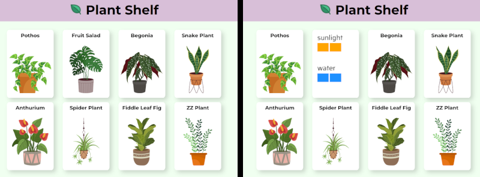

# 🌿Plantshelf  
In these 2 lessons, you will:  
* modify the structure (HTML) and style (CSS) of a webpage which shows image/information cards for different plants.  
* learn to use git and GitHub to back up and version-control your code.  

____
## **Part A** git, GitHub, and HTML
### GitHub | Forking a repository
- [ ] Go to [GitHub.com](https://github.com/signup) and create a free account (or login if your have one).  
- [ ] Go to [the PlantShelf repository](https://github.com/S-Mangan/plantshelf) and click Fork to create your own copy.

### VisualCode | Pulling from GitHub  
- [ ] Open VisualCode, and open your home folder (File > Open Folder).  
- [ ] Open the terminal view (Terminal > New Terminal) and open a (wsl/gitbash? **TODO** check what's available) terminal.  
- [ ] Create local version of your PlantShelf copy: (**TODO** command details).  
- [ ] Open the new local version (File > Open Folder > select plantshelf).

### VisualCode | Pushing to GitHub  
- [ ] Find the README.md file in the tree folder (View > Open View... > Folders), and put an `x` into the checkboxes (`[ ]`) you've completed.

In your (**TODO** wsl/gitbash) terminal:  
- [ ] `git config --global user.name "Your Name"`  
- [ ] `git config --global user.email "your@email.com"`  
- [ ] `git status`  

- [ ] `git add README.md`  
- [ ] `git status`  
- [ ] `git commit -m "Updated the readme"`  
- [ ] `git status`  
- [ ] `git branch -M main  `  

#### keys (**TODO**)
$ ssh-keygen -t ed25519 -C "your_email@example.com"  

$ eval "$(ssh-agent -s)"  
Agent pid 1174  

$ ssh-add

- [ ] `git branch -M main  `  
- [ ] `git remote add origin git@github.com:<your_github_username>/plantshelf.git`  
- [ ] `git push`  
- [ ] `git status`  
- [ ] Refresh your plantshelf fork on GitHub. You should see your checked items in the README.

### VisualCode | Changing the HTML  
- [ ] Find the index.html file in the tree folder, and  
> - [ ] click and drag the index.html a browser window to see PlantShelf website  
> - [ ] double click index.html to see the HTML  

- [ ] Modify the HTML and refresh your browser to see how the website changes:  
> - [ ] Update the GitHub link in the footer to point to your fork.  
> - [ ] Replace some of the card images (see the images folder), and update the card headings to match.  
> - [ ] Change the main website heading  

## **Part B** CSS
- [ ] **TODO** live server extension  
- [ ] TODO  
- [ ] TODO  

## [optional] Further information
#### YouTube | Git in 15 Minutes
- [ ] Watch [this YouTube video](https://github.com/signup) for a more detailed overview of git. Note that we didn't need to install git, and we don't need commands like `init`, `branch`, `checkout`, and `merge` for these lessons.